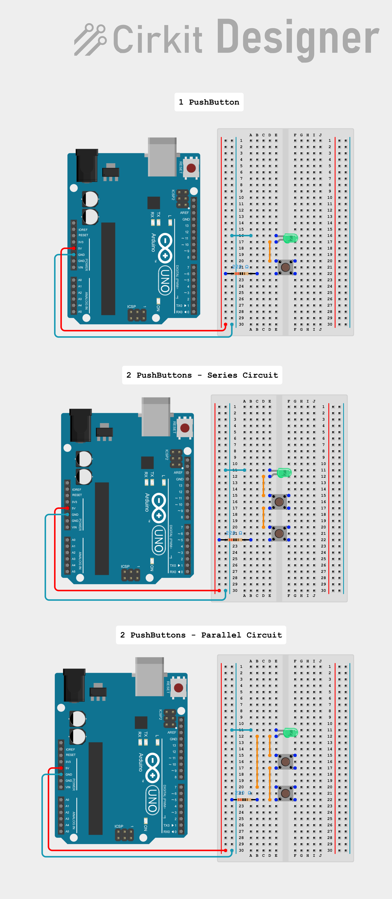
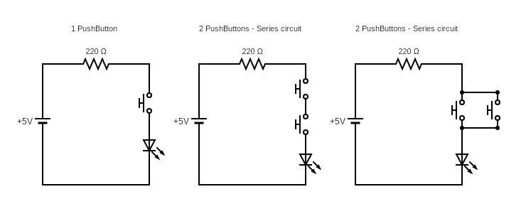

# Project 01 - Push to Light 
**Arduino Starter Kit Multi-Language Project 1**

## 🎯 Objective
Learn how to set up a basic circuit in Arduino and understand how series and parallel circuits work.

## 🧰 Components
- Arduino basics (Arduino Uno, breadboard, jumper wires, laptop)
- 2 x Push Buttons
- 1 x Green LED
- 1 x 220 Ω Resistor

## 📐 Schematics & Illustrations
- [View circuit design in Cirkit Designer](https://app.cirkitdesigner.com/project/473058cd-4498-4e97-a3f1-26292083ce17)  
- [View detailed schematics on CRCit](https://crcit.net/c/4fe34f5cc92d4b41a0c6d96038497459)

### 🖼️ Illustrations

  

### ⚙️ Circuit Schematics

  

