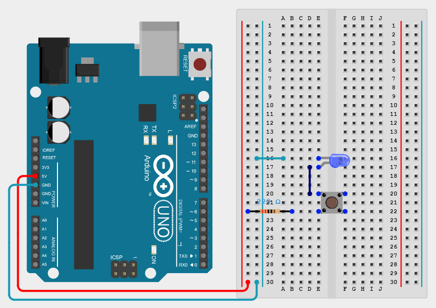

# Project_01
Arduino Starter Kit Multi-Language Project 1 - Push to Light

## Components
- Arduino Uno
- Jumper wires, breadboard
- PushButton
- Blue LED
- 220 Ω Resistor

## Wiring
https://app.cirkitdesigner.com/project/473058cd-4498-4e97-a3f1-26292083ce17

